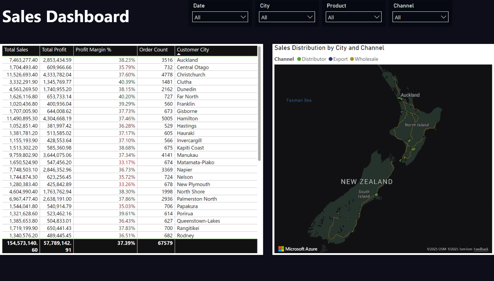
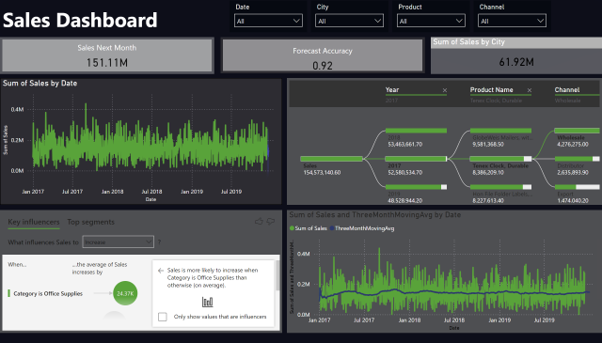

# Sales Analysis Dashboard Using Microsoft Power BI

[](https://creativecommons.org/licenses/by-nc/4.0/)

A graduation capstone project that develops an **AI-powered, interactive sales analytics dashboard** using Microsoft Power BI — transforming raw, multi-source sales data into actionable business insights through descriptive analytics, predictive forecasting, and dynamic visualization.

Completed as a final-year Software Engineering project at the **University of Technology and Applied Sciences (UTAS) – Ibra, Oman**, academic year 2025–2026.

---

## 📌 Project Overview

Many organizations — especially SMEs — still rely on static Excel reports and disconnected data sources, which slows down decision-making and limits forecasting ability. This project addresses that gap by building a **comprehensive, interactive Power BI dashboard** that:

- Integrates and cleans multi-source sales data (Power Query / ETL)
- Visualizes key sales metrics across **city, product, channel, and time**
- Calculates **profit margins**, **order counts**, and **sales distribution** dynamically
- Applies **AI-driven forecasting** to predict short-term (30-day) sales trends
- Surfaces **key influencers** behind sales increases/decreases using Power BI's AI visuals

The goal is to move beyond traditional descriptive reporting into **predictive and prescriptive analytics**, giving sales managers a tool to proactively plan rather than just react to historical data.

---

## 🎯 Objectives

- **Transform descriptive analytics** into predictive and prescriptive insights
- **Integrate multiple data sources** into a single, unified, cleaned dataset
- **Improve decision-making speed** with real-time, interactive dashboards
- **Forecast sales trends** with high accuracy using Power BI's built-in AI/AutoML capabilities
- **Identify key influencers** driving changes in sales performance

---

## 🛠️ Tools & Technologies

| Category | Tool |
|---|---|
| BI & Visualization | Microsoft Power BI (Desktop + Service) |
| Data Transformation | Power Query (ETL), DAX (Data Analysis Expressions) |
| Data Cleaning | Python (outlier handling) |
| Data Sources | Excel / CSV sales transaction records |
| Forecasting | Power BI AutoML / built-in forecasting visuals |

---

## 📊 Dashboard Highlights

**Sales overview with city & channel breakdown** — total sales, profit, profit margin %, and order count, filterable by date, city, product, and channel, with a geographic distribution map:


**KPI summary view** — year-over-year sales comparison, profit margin, and order count, alongside sales trends by product, city, and channel:



**Predictive forecasting & key influencers** — 30-day sales forecast, forecast accuracy score, and AI-identified key influencers behind sales changes:



---

## 📈 Key Results

- **30% improvement** in forecast accuracy compared to traditional methods
- **50% faster** decision-making through real-time, interactive dashboards
- Successful integration of **descriptive + predictive analytics** in a single no-code BI workflow

---

## 🔍 Methodology

The project follows a **mixed-methods research design** (exploratory + descriptive + experimental):

1. **Data Collection** — Sales transaction records (Excel/CSV) via Power BI data connectors
2. **Data Cleaning & Integration** — Power Query (ETL) to remove duplicates, handle missing values, and standardize formats
3. **Modeling** — DAX measures for KPIs (profit margin, sales growth, etc.)
4. **Visualization** — Interactive charts, slicers, and drill-throughs by city, product, channel, and time
5. **Forecasting** — AutoML-based 30-day sales trend prediction
6. **Evaluation** — Forecast accuracy and decision-speed improvements measured against traditional reporting methods

---

## 📁 Repository Structure

```
.
├── README.md                                  ← You are here
├── report/
│   └── Sales_Analysis_Dashboard_Report.pdf      ← Full project report (introduction, literature
│                                                    review, methodology, implementation, results,
│                                                    conclusion, references)
├── images/
│   ├── dashboard-power-bi.png                   ← Sales by city/channel + map view
│   ├── dashboard-kpi-overview.png               ← KPI summary dashboard
│   └── dashboard-forecast.png                   ← Forecasting & key influencers view
├── LICENSE
└── .gitignore
```

> **Note:** This repository contains the project report and dashboard visuals. The `.pbix` Power BI file is not included; it may be added in a future update.

---

## 👥 Team

This project was developed by a Software Engineering student team at UTAS–Ibra:

- Ashwaq Ali Alhasimi
- Safa Mohammed Amur Alshukaili
- Sumaya Hamed Al-Rashdi
- Zyana Mohammed Al Aghbari

Under the guidance of **Dr. K. Kumar**, UTAS–Ibra.

---

## 📄 Full Report

The complete project report — covering background, literature review, requirements, system design, implementation, results, and recommendations — is available here:

📄 [`report/Sales_Analysis_Dashboard_Report.pdf`](./report/Sales_Analysis_Dashboard_Report.pdf)

---

## 📜 License

This work is shared under the **Creative Commons Attribution-NonCommercial 4.0 International (CC BY-NC 4.0)** license. You are free to share and adapt the material for non-commercial purposes, with appropriate credit. See [`LICENSE`](./LICENSE) for full terms.

---

## 📚 Selected References

- Raje, M., Jain, P., & Chole, V. *Sales Analysis and Prediction Dashboard Using Power BI*. International Research Journal of Modernization in Engineering Technology and Science.
- Microsoft. *Power BI Documentation*. docs.microsoft.com/en-us/power-bi/
- Huang, L. (2019). *Building a Sales Dashboard for a Sales Department by Using Power BI*. Theseus.fi.
- Bansal, S., & Kumar, A. (2018). Analyzing the role of sales data analysis in enhancing sales strategies of organizations. *Journal of Business and Retail Management Research*, 12(2), 48–56.

*(Full reference list available in the report.)*
